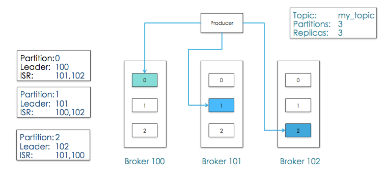
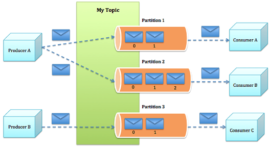
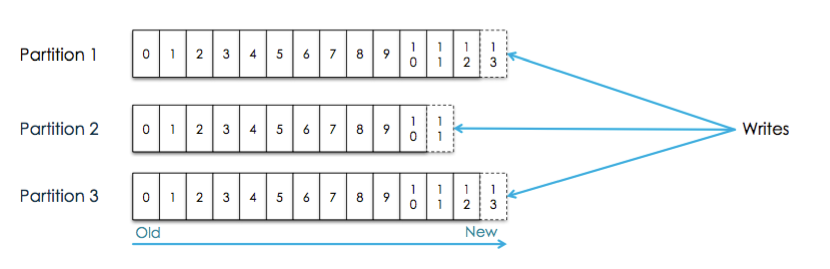
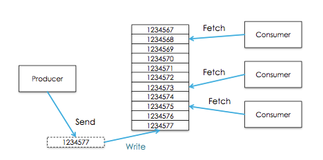
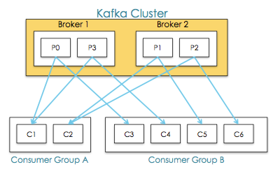

# Kafka学习
## 1. 简介
Kafka是一个分布式的消息队列，也是一个分布式的发布-订阅系统，还是一个分布式存储系统，是一个分布式、支持分区的（partition）、多副本（replica），基于zookeeper协调的分布式消息系统，它最大的特性就是可以实时的处理大量数据以满足各种需求场景。  

主要应用场景是：日志收集系统和消息系统

## 2. Kafka架构
### 2.1 拓扑结构
如下图：
  
### 2.2 相关概念
1. **producer**  
Processes that publish message to a kafka topic are called producers  
   
2. **topics**  
消息以topic为类别记录，Kafka将消息种子（Feed）分门别类，每一类消息称之为一个主题（topic）。  
  
3. **partitions**  
每个Topics划分为一个或者多个partition，并且partition中的每条消息都被标记了一个sequential id，也就是offset，并且存储的数据是可配置存储时间的。  
  
4. **broker**  
Kafka is run as a cluster comparised of one or more servers each of which is called broker  
    
5. **consumer**  
Processes that subscribe(订阅) to tpics and process the feed of published messages are called consumers  
    
Consumer可以从任一地方开始消费,然后又回到最大偏移量处,Consumers又可以被划分为Consumer Group  
6. **Consumer group**  
high-level consumer API 中，每个 consumer 都属于一个 consumer group，每条消息只能被 consumer group 中的一个 Consumer 消费，但可以被多个 consumer group 消费。  
     

