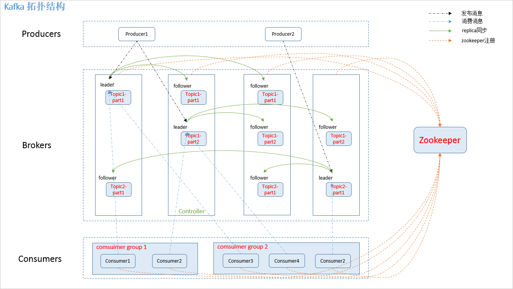
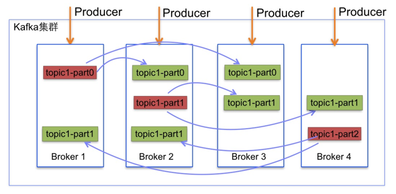
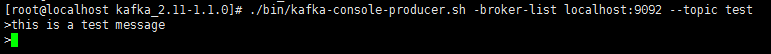

# Kafka学习
## 1. 简介
Kafka是一个分布式的消息队列，也是一个分布式的发布-订阅系统，还是一个分布式存储系统，是一个分布式、支持分区的（partition）、多副本（replica），基于zookeeper协调的分布式消息系统，它最大的特性就是可以实时的处理大量数据以满足各种需求场景。  

主要应用场景是：日志收集系统和消息系统

## 2. Kafka架构
### 2.1 拓扑结构
如下图：
  
### 2.2 相关概念
1. **producer**  
Processes that publish message to a kafka topic are called producers  
   
2. **topics**  
消息以topic为类别记录，Kafka将消息种子（Feed）分门别类，每一类消息称之为一个主题（topic）。  
  
3. **partitions**  
每个Topics划分为一个或者多个partition，并且partition中的每条消息都被标记了一个sequential id，也就是offset，并且存储的数据是可配置存储时间的。  
  
4. **broker**  
Kafka is run as a cluster comparised of one or more servers each of which is called broker  
    
5. **consumer**  
Processes that subscribe(订阅) to tpics and process the feed of published messages are called consumers  
    
Consumer可以从任一地方开始消费,然后又回到最大偏移量处,Consumers又可以被划分为Consumer Group  
6. **Consumer group**  
high-level consumer API 中，每个 consumer 都属于一个 consumer group，每条消息只能被 consumer group 中的一个 Consumer 消费，但可以被多个 consumer group 消费。  
     
7. **replica**  
partition的副本，保证partition的高可用  
8. **leader**  
replica中的一个角色，producer和consumer只跟leader交互  
9. **follower**  
replica中的一个角色，从leader中复制数据
### 2.3 zookeeper节点  
Kafka在zookeeper中的存储结构如下图所示：  
   
### 2.4 详细介绍  
Kafka目前主要作为一个分布式的发布订阅的消息系统使用，下面简单介绍一下kafka的基本机制  
1. **消息传输流程**  
     
**producer**即生产者，向Kafka集群发送消息，在发送消息之前，会对消息进行分类，即Topic。  
**Topic**即主题，通过对消息指定主题可以将消息分类，消费者可以只关注自己需要的Topic中的消息。  
**Consumer**即消费者，消费者通过与Kafka集群建立长连接的方式，不断地从集群中拉取消息，然后可以对这些消息进行处理。  
从上图可以看出同一个topic下的消费者和生产者的数量并不是对应的。  
2. **kafka服务器消息存储策略**  
   
谈到kafka的存储，就不得不提到分区，即partitions，创建一个topic时，同时可以指定分区数目，分区数越多，其吞吐量也越大，但是需要的资源也越多，同时也会导致更高的不可用性，kafka在接收到生产者发送的消息之后，会根据均衡策略将消息存储到不同的分区中。  
   
每个分区中，消息以顺序存储，最晚接收到的消息会最后被消费。  
3. **与生产者交互**  
   
生产者向kafka集群发送消息的时候，可以通过指定分区来发送到指定的分区中，也可以通过指定均衡策略来将消息发送到不同的分区中，如果不指定，将会采用默认的随机均衡策略，将消息随机的存储到不同的分区中。  
4. **与消费者交互**  
   
在消费者消费消息时，kafka使用offset来记录当前消费者的位置。  
在kafka的设计中，可以有多个不同的group来同时消费同一个topic下的消息，如图，我们有两个不同的group同时消费，他们的消费的记录位置offset各不相同，不互相干扰。  
对于一个group而言，消费者的数量不能多于分区的数量，因为在一个group中，每个分区至多只能绑定在一个消费者上，即一个消费者可以消费多个分区，一个分区只能给一个消费者消费。  
因此，若一个group中的消费者数量大于分区数量，多于的消费者将不会收到任何消息。  
## 3. Kafka安装和使用
### 3.1 下载
你可以在kafka官网 [http://kafka.apache.org/downloads](http://kafka.apache.org/downloads)下载到最新的kafka安装包，选择下载二进制版本的tgz文件。  
### 3.2 安装
Kafka是使用scala编写的运行与jvm虚拟机上的程序，虽然也可以在windows上使用，但是kafka基本上是运行在linux服务器上，因此我们这里也使用linux来开始今天的实战。  
首先确保你的机器上安装了jdk，kafka需要java运行环境，以前的kafka还需要zookeeper，新版的kafka已经内置了一个zookeeper环境，所以我们可以直接使用，说是安装，如果只需要进行最简单的尝试的话我们只需要解压到任意目录即可，这里我们将kafka压缩包解压到/usr/local目录。  
### 3.3 配置
在kafka解压目录下有一个config的文件夹，里面放置的是我们的配置文件  
consumer.properites 消费者配置  
producer.properties 生产者配置  
server.properties kafka服务器的配置，此配置文件用来配置kafka服务器，目前仅介绍最基础的配置  
1. broker.id申明当前kafka服务器在集群中的唯一ID，需配置为integer，并且集群中的每一个kafka服务器的id都应是唯一的，我们采用默认的配置即可  
2. listeners 申明此kafka服务器需要监听的端口号，如果是在本机上跑虚拟机运行可以不用配置本项，默认会使用localhost的地址，如果是在远程服务器上运行则必须配置，例如：listeners=PLAINTEXT:// 192.168.180.128:9092。并确保服务器的9092端口能够访问  
3. zookeeper.connect 申明kafka所连接的zookeeper的地址 ，需配置为zookeeper的地址  
### 3.4 运行
1. 启动zookeeper
进入zookeeper安装目录，输入
```
./zkServer.sh start
```
启动zookeeper成功后，会看到如下的输出，输入如下命令验证启动是否成功
```
echo ruok|nc localhost 2181
```  
  
2. 启动Kafka  
进入kafka解压目录，输入
```
./bin/kafka-server-start.sh config/server.properties
```
启动成功后，会看到如下输出
   
### 3.5 第一个消息  
1. 创建一个topic
Kafka通过topic对同一类的数据进行管理，同一类的数据使用同一个topic可以在处理数据时更加的便捷  
在kafka解压目录打开终端，输入  
```
./bin/kafka-topics.sh -create --zookeeper localhost:2181 -replication-factor 1 --partitions 1 -topic test
```
创建成功
   
查看已创建的topic  
```
./bin/kafka-topics.sh --list --zookeeper localhost:2181
```
  
2. 创建一个消费者
输入
```
./bin/kafka-console-consumer.sh --bootstrap-server localhost:9092 -topic test --from-beginning
```  
3. 创建一个生产者
不要关闭消费者终端，打开一个新的终端，输入  
```
./bin/kafka-console-producer.sh -broker-list localhost:9092 --topic test
```
执行完毕后会进入编辑器页面  
    
发送完消息后，可以回到我们的消费者终端，可以看到，终端已经打印了我们刚才发送的消息
    
## 4. java示例
生产者示例代码
```
package com.leicj.demo1;

import kafka.javaapi.producer.Producer;
import kafka.producer.KeyedMessage;
import kafka.producer.ProducerConfig;

import java.util.Date;
import java.util.Properties;

public class ProducerDemo {
    public static void main(String[] args) {
        int events = 100;
        //设置配置属性
        Properties props = new Properties();
        props.put("metadata.broker.list","192.168.133.129:9092");
        props.put("serializer.class","kafka.serializer.StringEncoder");
        props.put("key.serializer.class","kafka.serializer.StringEncoder");
        //可选配置，如果不配置，则使用默认的partitioner
        props.put("partitioner.class","com.leicj.demo1.PartitionerDemo");
        //触发acknowledgement机制，否则是fire and forget，可能会引起数据丢失
        props.put("request.required.acks","1");
        ProducerConfig config = new ProducerConfig(props);
        //创建producer
        Producer<String,String> producer = new Producer<String, String>(config);
        long start = System.currentTimeMillis();
        for (long i = 0; i < events; i++) {
            long runtime = new Date().getTime();
            String ip = "192.168.133.129";
            String msg = runtime + ",www.test.com," + ip;
            //如果topic不存在，则会自动创建，默认replication-factor为1，partitions为0
            KeyedMessage<String,String> data = new KeyedMessage<String, String>("test",ip,msg);
            producer.send(data);
        }
        System.out.println("耗时: " + (System.currentTimeMillis() - start));
        producer.close();
    }
}
```
Partitioning Code
```
package com.leicj.demo1;

import kafka.producer.Partitioner;
import kafka.utils.VerifiableProperties;

public class PartitionerDemo implements Partitioner {

    public PartitionerDemo(VerifiableProperties props) {}

    @Override
    public int partition(Object obj, int numPartitions) {
        int partition = 0;
        if (obj instanceof String) {
            String key = (String)obj;
            int offset = key.lastIndexOf('.');
            if (offset > 0) {
                partition = Integer.parseInt(key.substring(offset + 1)) % numPartitions;
            }
        }else {
            partition = obj.toString().length() % numPartitions;
        }
        return partition;
    }
}
```
消费者代码示例
```
package com.leicj.demo1;

import kafka.consumer.Consumer;
import kafka.consumer.ConsumerConfig;
import kafka.consumer.KafkaStream;
import kafka.javaapi.consumer.ConsumerConnector;

import java.util.HashMap;
import java.util.List;
import java.util.Map;
import java.util.Properties;
import java.util.concurrent.ExecutorService;
import java.util.concurrent.Executors;

public class ConsumerDemo {
    private final ConsumerConnector consumer;
    private final String topic;
    private ExecutorService executor;
    public ConsumerDemo(String a_zookeeper, String a_groupId, String a_topic) {
        consumer = Consumer.createJavaConsumerConnector(createConsumerConfig(a_zookeeper,a_groupId));
        this.topic = a_topic;
    }

    public void shutdown() {
        if (consumer != null) {
            consumer.shutdown();
        }
        if (executor != null) {
            executor.shutdown();
        }
    }

    public void run(int numThreads) {
        Map<String,Integer> topicCountMap = new HashMap<String, Integer>();
        topicCountMap.put(topic, new Integer(numThreads));
        Map<String, List<KafkaStream<byte[],byte[]>>> consumerMap = consumer.createMessageStreams(topicCountMap);
        List<KafkaStream<byte[],byte[]>> streams = consumerMap.get(topic);
        //now launch all the threads
        executor = Executors.newFixedThreadPool(numThreads);
        //now create an object to consume the messages
        int threadNumber = 0;
        for (final KafkaStream stream : streams) {
            executor.submit(new ConsumerMsgTask(stream,threadNumber));
            threadNumber++;
        }
    }

    private static ConsumerConfig createConsumerConfig(String a_zookeeper, String a_groupId) {
        Properties props = new Properties();
        props.put("zookeeper.connect",a_zookeeper);
        props.put("group.id",a_groupId);
        props.put("zookeeper.session.timeout.ms","400");
        props.put("zookeeper.sync.time.ms","200");
        props.put("auto.commit.interval.ms","1000");
        return new ConsumerConfig(props);
    }

    public static void main(String[] arg) {
        String[] args = { "192.168.133.129:2181", "0", "test", "10" };
        String zooKeeper = args[0];
        String groupId = args[1];
        String topic = args[2];
        int threads = Integer.parseInt(args[3]);

        ConsumerDemo demo = new ConsumerDemo(zooKeeper, groupId, topic);
        demo.run(threads);

        try {
            Thread.sleep(10000);
        } catch (InterruptedException ie) {

        }
        demo.shutdown();
    }
}
```
```
package com.leicj.demo1;

import kafka.consumer.ConsumerIterator;
import kafka.consumer.KafkaStream;

public class ConsumerMsgTask implements Runnable {
    private KafkaStream m_stream;
    private int m_threadNumber;

    public ConsumerMsgTask(KafkaStream m_stream, int m_threadNumber) {
        this.m_stream = m_stream;
        this.m_threadNumber = m_threadNumber;
    }

    @Override
    public void run() {
        ConsumerIterator<byte[],byte[]> it = m_stream.iterator();
        while (it.hasNext()) {
            System.out.println("Thread " + m_threadNumber + ":" + new String(it.next().message()));
        }
        System.out.println("Shutting down Thread: " + m_threadNumber);
    }
}
```
###代码示例问题分析
在执行ProducerDemo.Main()方法时，出现“kafka.common.FailedToSendMessageException: Failed to send messages after 3 tries.”错误

排查步骤:
1. 首先确认集群使用命令的方式发送和消费正常。
2. 缺少配置监听地址,在config/server.properties中设置listeners地址，如：  
listeners=PLAINTEXT://192.168.133.129:9092（注意：尽量用ip）
3. 确认应用程序所在机器连接到kafka集群是畅通的。（例如：telnet 192.168.133.129 9092）
4. 应用程序调用kafka集群的端口写错了，不是2181，是9092。（有的人分不清broker和zookeeper的端口号）
5. 配置修改后，没有重启kafka集群。


## 参考
1. https://blog.csdn.net/qq_24084925/article/details/78842844
2. http://orchome.com/342
3. http://www.importnew.com/24677.html


  


